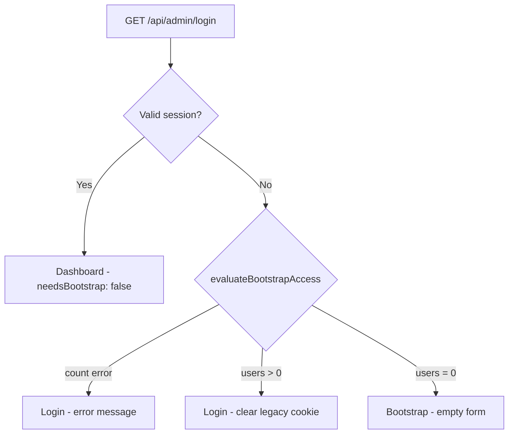

# Auth & Bootstrap Security Report

**Date:** 2026-07-08  
**Branch:** `cursor/auth-identity-fix-e022`  
**Scope:** Critical auth/bootstrap security fix (no UI polish, no new features)

## Executive Summary

Two critical issues were fixed:

1. **Owner PII leak** — bootstrap form prefilled Manuel Bauch / `manuel.bauch0705@gmail.com` in any browser.
2. **False bootstrap exposure** — setup wizard could appear when `admin_users` already had records or a valid session existed.

Both are resolved with empty form defaults, a centralized fail-closed bootstrap guard, and stricter client routing.

## Architecture (unchanged)

```
pb_admin_session cookie
  → admin_sessions.token_hash
  → admin_sessions.user_id
  → admin_users.id
```

- No Supabase `auth.users` for admin login
- No `pb_admin_auth` authentication path (cookie cleared when users exist)
- No virtual `legacy-session` user
- No „Administrator“ identity fallback in UI

## Audit Results

### Environment Variables

| Variable | Client exposure | Used for bootstrap |
|----------|-----------------|-------------------|
| `ADMIN_PASSWORD` | ❌ Server only | Setup verification |
| `ADMIN_EMAIL` | ❌ Not in codebase | — |
| `ADMIN_NAME` | ❌ Not in codebase | — |
| `NEXT_PUBLIC_SITE_URL` | ✅ Public (site URL only) | — |
| `NEXT_PUBLIC_SUPABASE_*` | ✅ Public (anon key) | — |
| `NEXT_PUBLIC_*` owner vars | ❌ None detected | — |

### Database Tables

| Table | Bootstrap role |
|-------|----------------|
| `admin_users` | Count must be 0 for bootstrap |
| `admin_sessions` | Valid session blocks bootstrap |
| `admin_roles` | `administrator` slug required for first user |
| `team_members` | Not used in bootstrap gate |
| `auth.users` | Not used for admin auth |

### Hardcoded Identity Audit

| Pattern | Live UI |
|---------|---------|
| `manuel` / `Manuel Bauch` in forms | ❌ Removed |
| `legacy-session` | ❌ Removed (prior commit) |
| `Administrator` as fallback identity | ❌ Removed (prior commit) |
| Role slug `administrator` → label „Super Admin“ | ✅ Intentional RBAC |

### Error Handling

| Error | Old behavior | New behavior |
|-------|--------------|--------------|
| Count query fails | Sometimes treated as 0 users | `allowed: false`, reason `count_query_failed` |
| `countAdminUsersSafe()` | Returned `0` | Returns `null` (unknown) |
| Network error in AdminGate | Login | Login (unchanged) |

## Decision Flow



## Build Verification

```bash
npm run lint
npm run typecheck
npm run build
```

## Related Reports

- `BOOTSTRAP_OWNER_DATA_LEAK_FIX_REPORT.md` — PII leak details
- `BOOTSTRAP_GUARD_FIX_REPORT.md` — guard logic and routing
- `AUTH_IDENTITY_FIX_REPORT.md` — prior legacy-session removal

## Post-Deploy Checklist

1. Open `/admin` in incognito → must show **login**, not bootstrap (if users exist)
2. Confirm no prefilled name/email on bootstrap (only when DB truly empty)
3. Log in → sidebar shows real `admin_users` identity
4. F5 → same identity, no bootstrap flash
5. Logout → login page, no owner data visible
